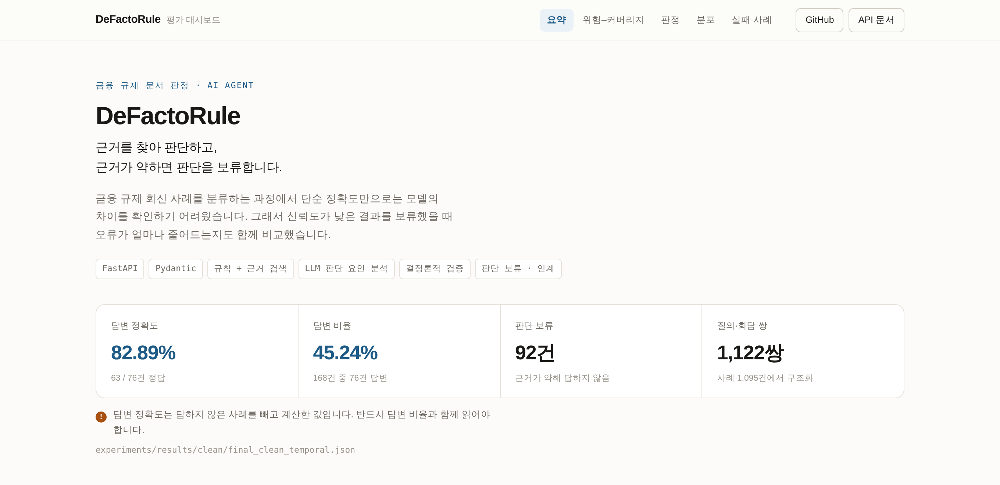
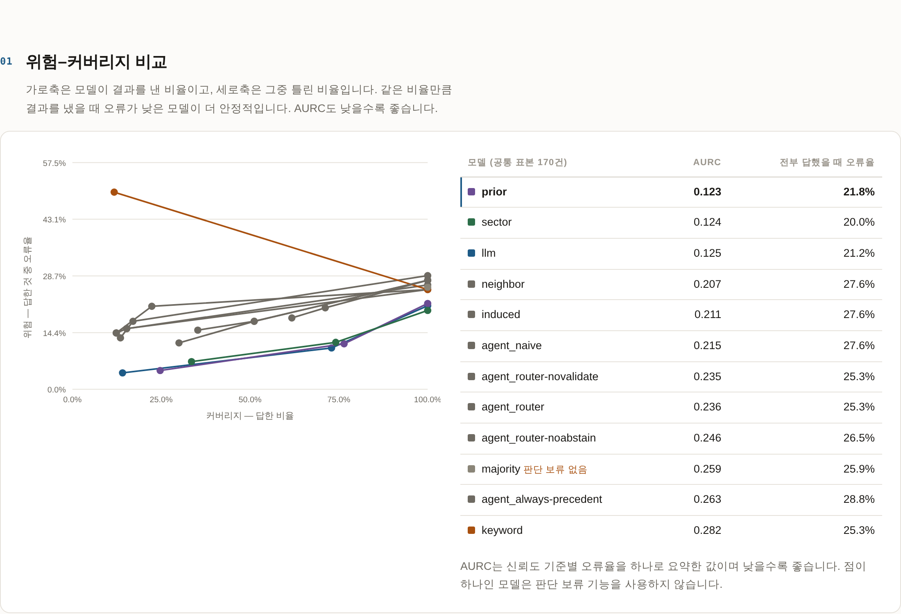
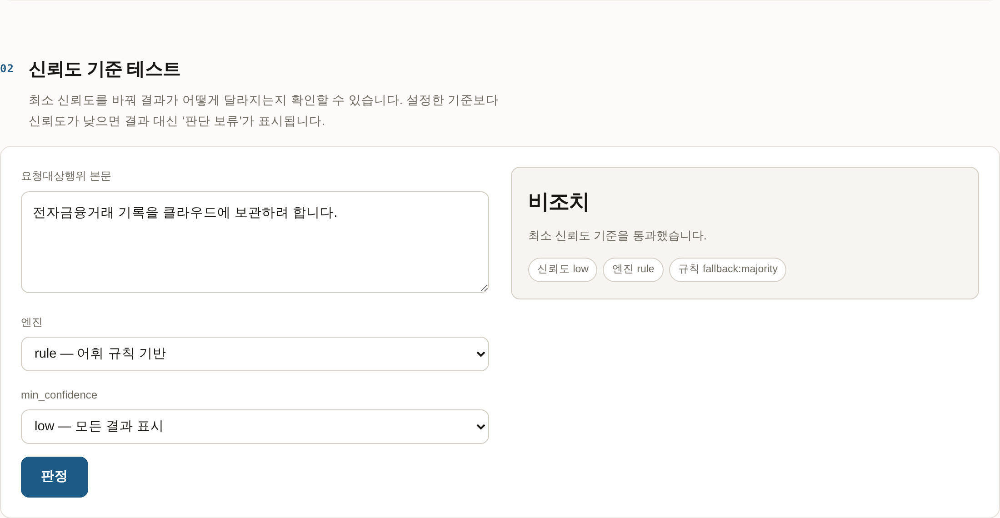
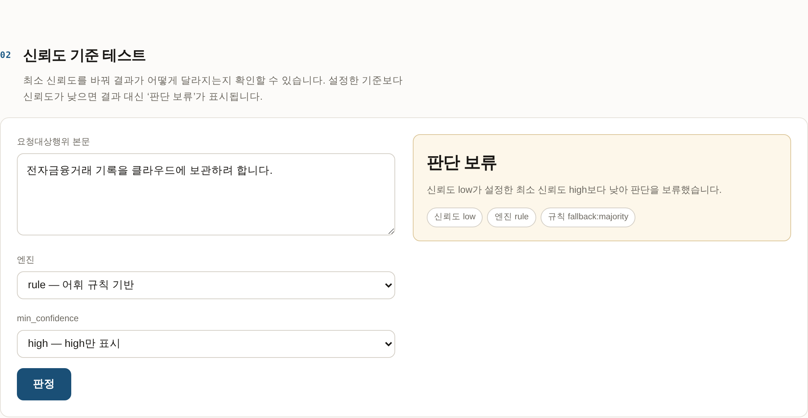
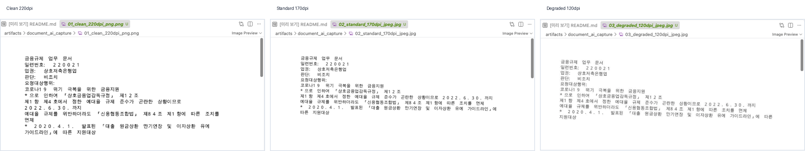
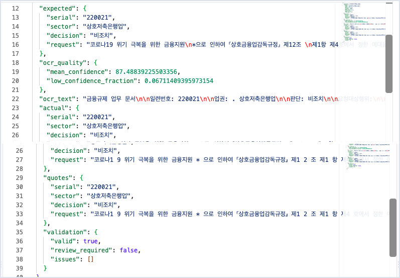
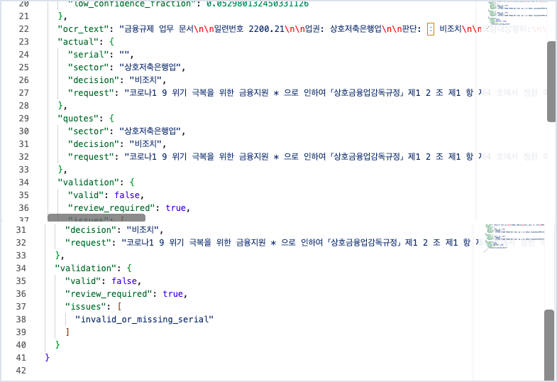
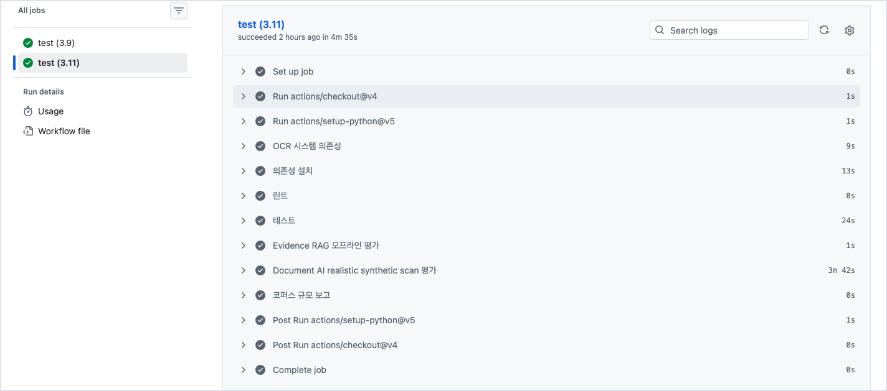

# DeFactoRule

**과거 규제 예외 판단에서 실제로 적용된 기준을 복원하고, 새 요청에 선례를 적용해도 되는지 검증하는 AI Agent Workflow.**

**Live Demo — <https://defactorule-kl5c.onrender.com>** · API 키 없이 동작한다.

금융당국 사례집 **1,095건 · 1,122쌍**을 PDF에서 구조화하고, 규칙·선례 검색·LLM deciding-factor 분석·결정론적 검증·기권을 하나의 판단 흐름으로 연결했다. 최종 clean 프로파일은 **test 168건 중 76건 답변 / 92건 기권, 답변 정확도 82.89%, coverage 45.24%**다. 이 수치는 S5로 억지 회수하지 않은 fail-closed 결과다.

별도 upstream 확장으로 **PDF / scan / image → OCR-aware Document AI → structured extraction / validation → Evidence RAG** 경로도 구현했다. OCR 평가는 실제 고객 스캔이 아니라 60개 금융 요청을 세 가지 품질로 rasterize한 synthetic benchmark이며, 결과와 한계를 decision/RAG 성능과 분리해서 기록한다.

`1. Problem` · `2. Why This Problem` · `3. What Makes It Different` · `4. System Overview` · `5. Demo` · `6. Architecture` · `7. Evaluation` · `8. Failure Cases` · `9. Experiments` · `10. Limitations`

---

## 1. Problem

기업의 실제 업무 판단은 규정 문구만으로 끝나지 않는다. 같은 규정 아래에서도 과거에 무엇을 허용했고 무엇을 막았는지, 어떤 차이가 결론을 갈랐는지가 조직의 **De Facto Rule**로 축적된다. 문제는 그 기준이 문서 한 곳에 명시돼 있지 않다는 점이다.

이 프로젝트는 금융규제 사례집을 공개된 관측 창으로 사용한다. PDF에서 요청·회답·라벨을 구조화하고, 새 요청에 대해 **명시 규칙 + 과거 선례 + 결정적 차이**를 함께 보면서 답할지 기권할지를 결정한다.

핵심 질문은 “가장 비슷한 문서를 찾았는가?”가 아니다.

> **이 선례가 지금 요청에도 실제로 적용 가능한가? 무엇이 결론을 가르는 차이인가?**

## 2. Why This Problem

검색만으로는 충분하지 않다. 가장 닮은 선례를 그대로 따라가는 `neighbor`는 선례와 정답이 같은 구간에서는 강하지만 결론이 갈리는 **TRAP** 구간에서는 구조적으로 실패했다.

더 중요한 문제는 근거 가용성이 클래스마다 다르다는 점이다.

<!-- README_BLIND:시작 -->
| 정답 | test 건수 | dev 에 닮은 선례가 있는 건수 | 비율 |
|---|---|---|---|
| `조치` | 14 | 1 | **7.1%** |
| `기타` | 30 | 16 | **53.3%** |
| `비조치` | 126 | 70 | **55.6%** |
<!-- README_BLIND:끝 -->

제재로 이어질 수 있는 `조치`는 표본도, 닮은 선례도 적다. 그래서 DeFactoRule은 **항상 답하는 분류기**보다 다음 세 가지를 우선한다.

1. 미래 선례를 보지 않는 검색 계약
2. 표면 유사도와 실제 적용 가능성의 분리
3. 근거가 부족하거나 충돌하면 기권하는 운영 계약

## 3. What Makes It Different

| 흔한 접근 | DeFactoRule |
|---|---|
| PDF를 검색 가능한 텍스트로만 만든다 | PDF → 사례 → 요청·회답 → 구조화된 평가 단위까지 결정론적으로 만든다 |
| 스캔 문서를 OCR text로 바로 신뢰한다 | native/OCR 분기 → field/quote 추출 → schema/grounding/confidence 검증 → review 또는 downstream |
| 가장 비슷한 선례를 답으로 사용한다 | **Temporal eligibility → Retrieval → Router → Applicability** 순서로 적용 가능성을 따진다 |
| LLM이 최종 판단과 근거를 함께 생성한다 | LLM은 조건·차이를 구조화하고, 최종 safety basis는 결정론적 gate가 계산한다 |
| 애매해도 답한다 | `abstain / human handoff`를 정상 출력으로 취급한다 |
| 평가 결과만 보고 규칙을 고친다 | dev/test 경계, provenance, regression guard를 먼저 고정하고 test 피드백 튜닝을 금지한다 |
| 성공 사례만 보여준다 | 실패한 가설·과잉 기권·temporal proxy·OCR confidence 한계까지 frozen artifact에 남긴다 |

초기 7개 판정기 비교에서는 F1 7/21 · **AURC 10/21 유의**였다. 그러나 최종 Agent의 목적은 그 legacy 실험을 이겼다고 주장하는 것이 아니다. 최종 단계에서는 데이터 누수와 미래 선례를 제거한 clean protocol 아래에서 **잘못된 선례 적용을 막는 안전한 workflow**를 고정했다.

## 4. System Overview

```text
[casebook / offline evaluation]
금융규제 사례집 PDF
        │
        ▼
결정론적 문서 구조화
PDF → 사례 → 요청·회답 쌍 → 라벨
        │
        ▼
clean group split
동일/날짜 변형 사안이 dev↔test를 넘지 않게 그룹 단위 분리
        │
        └─────────────────────────────┐
                                      │
[live / document intake]              │
PDF / scan / image                     │
        │                              │
        ▼                              │
native text or Korean OCR              │
        │                              │
        ▼                              │
structured extraction + validation     │
        │ validated only               │
        └─────────────────────────────┤
                                      ▼
Temporal Eligibility
T-serial proxy로 현재 요청보다 이전인 후보만 retrieval pool에 남김
        │
        ▼
Evidence Retrieval + De Facto Rules
문자 4-gram IDF 선례 + runtime-compatible E6 규칙
        │
        ▼
Router
명확한 근거 / 충돌 / 표면유사 / 근거부족을 구분
        │
        ├── 충분한 근거 ───────────────▶ 결정론적 decision + validation
        │
        └── 위험·모호 subset
                 │
                 ▼
          LLM Deciding-Factor Agent
      shared / request-only / precedent-only 조건 추출
                 │
                 ▼
        Deterministic Diff Coverage Gate
          ├─ grounded decisive difference → 선례 적용 차단
          ├─ 분석 불완전 → abstain / handoff
          └─ 차이 없음 → recovery 후보일 뿐, 현재는 자동 회수하지 않음
```

**LLM과 코드의 역할을 의도적으로 분리했다.**

| LLM | 결정론적 코드 |
|---|---|
| 긴 업무 요청에서 공통 조건 구조화 | PDF/레코드 파싱과 키 생성 |
| 요청에만 있는 조건 추출 | temporal candidate filtering |
| 선례에만 있는 조건 추출 | retrieval ranking · rule matching |
| 결정적 차이 후보 표시 | factor literal grounding 검증 |
| OCR/native text에서 optional structured fields 추출 | Document AI schema / quote / OCR-quality gate |
| — | Diff Coverage Gate · route · abstain · trace |
| — | 평가 · provenance · regression guard |

LLM 출력 스키마에는 `verdict`, `applies/differs`, `applicability_basis` 자체가 없다. 모델이 결론을 직접 정하지 못하게 하고, 원문에 실제로 존재하는 factor만 안전 gate의 입력으로 사용한다.

## 5. Demo

배포된 화면은 **<https://defactorule-kl5c.onrender.com>** 이다. 위험–커버리지 곡선, 최소 신뢰도를 직접 움직여 보는 판정,
업권별 라벨 분포, 실패 사례의 현재 상태를 보여준다. 서버가 그 자리에서 모델을 돌리지 않고
커밋된 산출물만 읽으므로 API 키가 필요 없다. 무료 플랜이라 15분 이상 접속이 없으면 잠들고,
그 뒤 첫 요청은 30초에서 1분쯤 걸린다.



상단 수치는 화면에 적어 둔 값이 아니다. `GET /evaluation/summary` 가
`experiments/results/clean/final_clean_temporal.json` 과 데이터 파일 행 수를 읽어
돌려준다. 재평가하면 화면도 같이 움직인다.



같은 비율만큼 답했을 때 어느 모델이 덜 틀리는지 본다. 점이 하나뿐인 모델은
기권할 줄 모르는 모델이다.

같은 요청이라도 최소 신뢰도를 올리면 답하지 않는다.

| `min_confidence: low` | `min_confidence: high` |
|---|---|
|  |  |


로컬에서 띄우려면 Python 3.9 이상이 필요하다.

```bash
git clone https://github.com/sokldjs554/DeFactoRule
cd DeFactoRule
pip3 install -r requirements.txt
python3 scripts/check_env.py
python3 scripts/serve.py
```

### 배포

Render Blueprint(`render.yaml`)로 배포한다. 빌드 단계에서 서비스가 읽을 산출물이 다 있는지 먼저 확인하고,
하나라도 없으면 빌드를 실패시켜 **배포 자체가 일어나지 않게** 한다. 그러면 이미 떠 있는 인스턴스가 그대로 서빙한다.

```yaml
buildCommand: pip install -r requirements.txt && python3 scripts/check_release.py
healthCheckPath: /health
```

`/health` 는 산출물이 없어도 2xx 를 돌려준다. Render 의 health check 는 배포 때만 도는 것이 아니라 살아 있는
인스턴스에도 계속 요청을 보내고, 5xx 가 60초 이어지면 인스턴스를 재시작한다. 파일이 빠진 것은 재시작으로 낫지
않으므로, 거기서 5xx 를 내면 낫지 않는 상태를 고치려고 무한히 재시작하다 서비스가 죽는다. **살아 있는가**와
**준비됐는가**는 다른 질문이고, 준비 여부는 되돌릴 수 있는 빌드 단계에서 막는다.

최종 clean 결과는 외부 API 없이 다시 계산할 수 있다.

```bash
python3 scripts/calibrate_temporal.py
python3 scripts/final_freeze.py
```

`final_freeze.py`는 다음 계약이 깨지면 실패한다.

- clean test 168건
- final answered 76 / abstained 92 / correct 63 / wrong 13
- runtime E6에서 지원하지 않는 `sector` atom 제거
- sector 제거 전후 **row-level Router behavior 변화 0건**
- frozen JSON artifact와 재계산 결과 동일

FastAPI UI는 기존 연구 결과와 실패 레지스트리를 탐색하는 용도다.

| 엔드포인트 | 역할 |
|---|---|
| `POST /classify` | 기존 분류 서비스 + 기권 계약 |
| `POST /rag/evidence` | temporal Evidence RAG retrieval + optional grounded memo |
| `GET /rag/samples` | 화면이 고르는 사례 목록 (clean test에서 업권별 한 건) |
| `GET /base-rates` | dev 기반 기저율 |
| `GET /evaluation/summary` | 최종 평가 요약 (커밋된 산출물을 읽는다) |
| `GET /evaluation/models` | 판정기 비교 결과 |
| `GET /evaluation/risk-coverage` | 위험–커버리지 곡선/AURC |
| `GET /failures` | 실패 레지스트리와 재현 probe |

OCR-aware intake는 CLI에서도 재현할 수 있다.

```bash
# Document AI 전용 checks + 60문서 × 3프로필 benchmark
python scripts/evaluate_document_ai.py --n 60

# 실제 캡처용 동일 입력 3개 품질 생성 - API 호출 없음
python scripts/render_document_ai_samples.py \
  --output-dir artifacts/document_ai_capture \
  --sample 12
```

실행 캡처 위치와 화면 구성은 [`docs/31-portfolio-capture-guide.md`](docs/31-portfolio-capture-guide.md)에 고정했다. 저장소에는 가짜 실행 이미지나 생성된 목업을 넣지 않는다.

## 6. Architecture

```text
app/
  core/            공용 I/O · text normalization · audit
  domain/          라벨 · similarity threshold · temporal contract
  extraction/      PDF → 사례 → 질의·회답 구조화
  document_ai/     native/OCR intake · structured extraction · validation · RAG bridge
  rules/           E6 rule induction + runtime capability projection
  retrieval/       lexical · dense · hybrid retriever
  rag/             temporal Evidence RAG · provenance · memo grounding
  agents/          Router · temporal calibration · deciding-factor Agent
  evaluation/      clean profile · metrics · final freeze
  infrastructure/  Anthropic API boundary · structured-output handling
  api/             FastAPI service

scripts/           얇은 CLI / 실험·freeze 진입점
tests/             core unit · integration · evaluation · regression
checks/document_ai Document AI 전용 contract / OCR checks
experiments/       frozen result artifacts
```

Core suite는 테스트 <!--TESTS-->580<!--/TESTS-->개를 수집하며 현재 CI 기준 **569 passed / 11 skipped**다. Python 3.9와 3.11에서 core suite와 Evidence RAG 오프라인 평가를 함께 실행한다. 별도 Document AI suite는 **17 checks**이며, 실제 Tesseract 한국어 OCR과 60문서 × 3프로필 benchmark는 Python 3.11 job에서 실행한다.

### OCR-aware Document AI intake

OCR headline은 쉬운 scalar field만 골라 100%를 보여주지 않는다. 60개 금융 요청을 clean-test pool 전반에서 고정 샘플링하고, serial / sector / decision / **긴 request 전체**를 exact field metric에 포함했다.

| Synthetic scan profile | Request char acc. | Field F1 exact | Review rate | Error-detection recall |
|---|---:|---:|---:|---:|
| clean 220dpi PNG | **94.38%** | **75.42%** | 1.67% | 1.69% |
| standard 170dpi JPEG | **89.79%** | **75.11%** | 10.00% | 10.53% |
| degraded 120dpi JPEG | **93.53%** | **62.44%** | 58.33% | 58.33% |

Tesseract confidence gate는 post-gate 결과를 보기 전에 `mean confidence < 80` 또는 `low-confidence token > 20%`로 고정했다. 실험 결과 degraded 입력은 상당수 review로 보냈지만, clean/standard의 **high-confidence OCR 오독은 잘 잡지 못했다.** 따라서 confidence는 보조 quality signal이지 ground-truth 검증기가 아니다. 상세 설계/수치/한계는 [`docs/30-document-ai-ocr.md`](docs/30-document-ai-ocr.md)에 남겼다.

#### 실제 입력 품질 3단계

같은 금융 업무 문서를 Clean / Standard / Degraded 조건으로 렌더링한 실제 재현 캡처다.



#### OCR → 구조화 → 검증

OCR 결과를 그대로 downstream에 넘기지 않고 `expected / OCR quality / actual / validation`을 함께 확인한다.



#### 실패 사례: high-confidence OCR도 검증한다

Degraded 입력에서 OCR confidence가 높아도 serial 필드가 깨질 수 있었다. deterministic validator가 `invalid_or_missing_serial`을 감지해 `review_required=true`로 전환한 실제 사례다.



#### CI 재현성

Python 3.9 / 3.11 core suite와 Evidence RAG를 검증하고, Python 3.11에서 실제 Korean Tesseract 기반 60×3 Document AI benchmark를 실행한다.



### Live Claude contract audit - Schema-valid != Evidence-grounded

고정된 **29건(S5 19 + RAG 10)**을 대상으로 실제 `claude-opus-5` 호출을 별도 audit했다. 이 실험은 final decision 성능을 높이기 위한 benchmark가 아니라, live LLM 출력이 기존 schema / grounding / fail-closed 계약을 지키는지 확인하는 소규모 contract audit이다.

| 항목 | Live audit |
|---|---:|
| API success | **27 / 29** |
| structured schema valid | **27 / 27 successful calls** |
| S5 factor literal grounding | **141 / 152** |
| rejected S5 factors | **11 items across 10 samples** |
| RAG invalid citation IDs | **0** |
| RAG ungrounded exact quote | **1** |
| unsupported output | **12 items across 11 / 29 fixed samples** |

성공한 호출은 모두 schema를 통과했지만 content grounding에서는 unsupported output이 실제로 관측됐다. 특히 RAG의 ungrounded exact quote 1건은 deterministic validator가 차단해 **`abstain (fail-closed)`**로 전환했다. 따라서 structured JSON을 받았다는 사실만으로 evidence-grounded output이라고 간주하지 않는다.

이 audit 전후 final clean 168건의 **76 / 92 / 63 / 13 profile은 불변**이며, 결과를 본 뒤 prompt / threshold / Router / retrieval을 다시 튜닝하지 않았다. 상세 범위와 한계는 [`docs/32-live-llm-audit.md`](docs/32-live-llm-audit.md), aggregate freeze는 [`experiments/results/clean/live_llm_audit_summary.json`](experiments/results/clean/live_llm_audit_summary.json)에 기록했다.

### Runtime contract mismatch를 어떻게 처리했나

clean E6가 학습한 11개 규칙 중 #8은 `sector='공통'`이라는 editorial metadata를 사용했다. 그러나 live Router는 request text만 받으므로 이 규칙은 production에서 절대 발화할 수 없었다.

처음에는 `sector`를 제외하고 규칙을 다시 유도하는 진단을 해봤지만, test에서 answered 101 / wrong 26으로 안전성이 악화됐다. 이 결과를 보고 규칙을 골라내는 대신 진단을 폐기했다. 최종 구현은 **이미 frozen된 E6에서 runtime이 평가할 수 없는 규칙 #8 전체만 capability projection으로 제거**한다. 대체 규칙을 새로 학습하지 않고 원래 order도 보존한다. 그 결과 최종 168건에서 C-3와 row-level 동작이 완전히 동일했다.

## 7. Evaluation

### 7.1 Final clean operating profile

최종 운영 프로파일은 legacy random-like split이 아니라 **group-based clean split**을 사용한다. normalized request와 날짜 변형이 dev/test 경계를 넘지 않게 묶고, retrieval 전에 T-serial eligibility를 적용한다. T-serial은 실제 결정일자가 없는 데이터에서 쓰는 **chronology proxy**이지 실제 시간의 ground truth라고 주장하지 않는다.

| 항목 | Final clean |
|---|---:|
| dev / test | 87 / 168 |
| answered / abstained | 76 / 92 |
| correct / wrong (answered) | 63 / 13 |
| coverage | **45.24%** |
| answered accuracy | **82.89%** |
| Path A / B / C | 15 / 61 / 92 |
| abstain — conflicting evidence | 60 |
| abstain — no evidence | 23 |
| abstain — surface only | 7 |
| abstain — ambiguous margin | 2 |

이 수치는 `experiments/results/clean/final_clean_temporal.json`에 고정돼 있고 CI가 재계산 결과와 byte-level 구조가 아닌 **JSON 의미 수준의 동일성**을 검사한다.

Temporal-matched clean dev calibration도 retrieval 계약과 같은 T-serial 조건에서 다시 계산했다. trust band는 27건 중 2건 오류, doubt band는 50건 중 23건 오류였고 두 Wilson 구간은 분리됐다. 하지만 이 재보정은 최종 Router의 76/92/63/13을 바꾸지 않았다. temporal의 가치는 정확도 상승보다 **미래 선례를 후보에서 먼저 제외하는 causal integrity**에 있다.

### 7.2 S5 — deciding-factor safety audit

C-4에서는 temporal 적용 후 선정한 5건을 별도 qualitative audit했다. LLM은 두 요청문의 factor만 구조화하고, deterministic gate가 literal grounding과 한쪽에만 존재하는 결정적 차이를 확인했다.

- `240006`, `230067`, `240022`, `220070`: grounded decisive difference로 G4
- `250055`: 사전 기대는 `no_decisive_difference`였지만 최종 G4

따라서 **safe recovery는 검증되지 않았다.** 이 결과를 숨기지 않고 S5를 자동 회수기가 아니라 **fail-closed safety veto**로 제한했다. aggregate 168건 성능에는 S5 회수를 넣지 않았다. 상세 frozen summary: `experiments/results/clean/c4_s5_audit_summary.json`.

### 7.3 Historical model study — clean freeze와 별도 트랙

아래 표들은 초기 170건 protocol에서 모델 특성과 위험–커버리지를 연구한 historical experiment다. 최종 clean 168건 operating profile과 직접 성능 비교하지 않는다.

<!-- README_F1:시작 -->
| 모델 | 매크로 F1 (커버리지 100%) |
|---|---|
| `sector` | 0.636 |
| `llm` | 0.587 |
| `neighbor` | 0.538 |
| `prior` | 0.504 |
| `keyword` | 0.494 |
| `induced` | 0.434 |
| `majority` | 0.284 |
<!-- README_F1:끝 -->

**TRAP**은 test 요청의 최근접 dev 선례가 정답과 반대 결론인 구간을 따로 보는 지표다. 표면 유사도를 그대로 복사하는 `neighbor`는 이 구간에서 0이 된다.

<!-- README_TRAP:시작 -->
순응 72건 · 함정 15건 · 선례 없음 83건 (닮음 문턱 0.15, 문자 4-gram IDF 코사인)

| 모델 | 전체 | 순응 72건 | 함정 15건 (TRAP) | 격차 |
|---|---|---|---|---|
| `sector` | 0.800 | 0.958 | **0.467** | 0.492 |
| `majority` | 0.741 | 0.889 | **0.400** | 0.489 |
| `llm` | 0.769 | 0.915 | **0.357** | 0.558 |
| `prior` | 0.763 | 0.915 | **0.357** | 0.558 |
| `keyword` | 0.747 | 0.903 | **0.133** | 0.769 |
| `neighbor` | 0.724 | 1.000 | **0.000** | 1.000 |
<!-- README_TRAP:끝 -->

초기 Agent ablation도 historical artifact로 보존한다.

<!-- README_AGENT:시작 -->
| 변형 | 커버리지 | 답한 것 정확도 | 매크로 F1 | 함정 15건 (맞힘/틀림/기권) |
|---|---|---|---|---|
| `naive` | 100.0% | 0.724 | 0.538 | 0 / **15** / 0 |
| `always-precedent` | 51.2% | 0.839 | 0.593 | 1 / **14** / 0 |
| `router` | 54.1% | 0.837 | 0.609 | 2 / **5** / 8 |
| `router-noabstain` | 98.2% | 0.749 | 0.476 | 2 / **13** / 0 |
| `router-novalidate` | 54.1% | 0.837 | 0.609 | 2 / **5** / 8 |

기권 78건 중 **답했어도 맞았을 것이 50건(64%)** — 과잉 기권이 지금의 가장 큰 약점이다.
<!-- README_AGENT:끝 -->

이 legacy 진단에서 **과잉 기권 50건**이 확인됐고, 이것이 applicability 분석을 추가한 직접적인 동기였다. 최종 clean workflow에서는 temporal eligibility와 protocol leakage를 먼저 바로잡았기 때문에 위 표를 최종 운영 수치로 재사용하지 않는다.

## 8. Failure Cases

실패 케이스 78건을 extraction / labeling / retrieval / evaluation / agent / infrastructure 계층으로 관리한다. 단순 메모가 아니라 재현 가능한 probe가 있는 failure registry다.

| ID | 실패 | 대응 |
|---|---|---|
| EX-05 | PDF 항목명의 뒷조각이 값 앞에 남음 | parser regression으로 406건 → 0건 |
| EX-16 | 서로 다른 질의·회답을 순번 교집합으로 잘못 결합 | pair splitting regression |
| EV-14 | 모델 수정 뒤 문서 판정이 예전 상태로 남음 | artifact→docs 동기화 검사 |
| EV-16 | 규칙 후보가 조용히 버려져 원인 추적 불가 | 공용 discard audit |
| AG-13 | 높은 lexical similarity에서 결정적 조건을 놓치고 공유 문구를 근거로 사용 | S5 deciding-factor + deterministic grounding; class-wide 해결로는 주장하지 않음 |

고친 실패가 다시 열리거나, 문서 숫자가 frozen artifact와 달라지거나, final profile이 76/92/63/13에서 변하면 CI가 실패한다.

## 9. Experiments

| 단계 | 질문 | 결론 |
|---|---|---|
| E1 | LLM이 규칙 baseline보다 나은가 | 매크로 F1 0.587 vs 0.494 — 단독 우위 주장은 보류 |
| E2 | confidence 기반 기권은 가치가 있는가 | AURC 0.125 vs 0.282 — 유의 |
| E3 | 어느 도메인 구간이 어려운가 | 초기 진단을 데이터로 정정 |
| E4 | 기저율을 프롬프트에 넣으면 개선되는가 | 가설 기각 |
| E5 | 최근접 선례만 따르면 되는가 | `neighbor` TRAP 0.000 |
| E6 | dev에서 역추출한 규칙이 test로 전이되는가 | 소수 클래스 규칙의 취약성 확인 |
| E7 | 7개 모델 전수 비교 | F1 7/21 · **AURC 10/21 유의** |
| E8~E11a | Router/기권/Validator ablation | 함정 오류 감소와 coverage 비용 확인 |
| E11b | LLM applicability만으로 표면선례 문제를 해결하는가 | AG-13 발견, 단독 해결 실패 |
| C-1 | 미래 선례를 제거하면 retrieval이 얼마나 변하는가 | T-serial 선택; strict-year는 지나치게 파괴적 |
| C-2 | temporal eligibility를 retrieval 전에 넣을 수 있는가 | 구현 완료; 성능 향상이 아니라 integrity 목적 |
| C-3 | 같은 temporal 정책으로 risk를 다시 보정하면 결과가 바뀌는가 | calibration 정합화, Router 수치는 동일 |
| C-4 | LLM이 결정적 차이를 구조화하고 코드가 검증할 수 있는가 | safety veto로 채택, safe recovery는 미검증 |
| C-5 | runtime schema와 frozen rule asset을 일치시킬 수 있는가 | unsupported sector #8 제거, row-level delta 0 |
| D-1 | scan/image 입력을 구조화해 downstream으로 안전하게 넘길 수 있는가 | OCR-aware intake 구현; 60×3 synthetic scan에서 품질별 field F1과 review 동작 측정 |
| D-2 | OCR confidence가 실제 오독을 충분히 검출하는가 | degraded에는 일부 유효, clean/standard high-confidence 오독에는 부족 - 한계로 동결 |
| L-1 | schema-valid live Claude 출력도 원문 grounding을 별도로 검증해야 하는가 | 29건 fixed audit에서 schema 27/27 통과 후에도 unsupported output 12 items 관측; RAG quote 1건은 fail-closed abstain |

최종 hardening 근거는 다음 frozen artifacts에 있다.

- `experiments/results/clean/trap_risk_clean_temporal.json`
- `experiments/results/clean/e6_rules_clean_runtime.json`
- `experiments/results/clean/c4_s5_audit_summary.json`
- `experiments/results/clean/final_clean_temporal.json`
- `experiments/results/clean/rag_retrieval.json`
- `experiments/results/clean/document_ai_ocr.json`
- `experiments/results/clean/live_llm_audit_summary.json`

세부 설계와 실패 과정은 `docs/20-final-agent-workflow-design.md` 이후 문서에 이어진다.

## 10. Limitations

- **Coverage를 희생한다.** 최종 clean test 168건 중 92건을 기권한다. 답변 정확도 82.89%는 반드시 coverage 45.24%와 함께 읽어야 한다.
- **T-serial은 실제 시간축이 아니다.** 데이터에 결정/회신일이 일관되게 없어서 serial 순서를 chronology proxy로 쓴다. 과거 실측에서 실제 날짜 순서와의 inversion이 존재했으므로 “temporal-safe”라고 부르지 않는다.
- **S5 safe recovery는 검증되지 않았다.** 5건 qualitative audit에서 적용 후보 `250055`도 decisive difference로 차단됐다. 따라서 현재 S5는 잘못된 선례 적용을 막는 veto이지 coverage 회수 장치가 아니다.
- **Live LLM audit은 작고 stochastic한 fixed audit이다.** 29건에서 11개 sample에 unsupported output이 관측됐지만 이를 Claude의 일반 오류율이나 production 성능으로 해석하지 않는다.
- **`조치` 선례 근거가 희소하다.** clean test의 소수 클래스에 threshold-positive precedent가 거의 없어 retrieval 기반 개선이 구조적으로 어렵다.
- **DOUBT/TRUST는 clean dev에서 band separation을 지지하지만 유일 최적값으로 재탐색한 값은 아니다.** 성능을 맞추기 위한 threshold tuning은 하지 않았다.
- **Document AI/OCR은 synthetic benchmark 범위다.** Tesseract 한국어 baseline과 native/OCR intake, field/quote 구조화, confidence/grounding validation, RAG bridge를 구현했지만 실제 고객 스캔·OCR fine-tuning·table recognition·image-VLM benchmark는 없다.
- **OCR confidence만으로는 high-confidence 오독을 충분히 검출하지 못했다.** clean/standard에서 ground-truth field mismatch의 review recall은 각각 1.69% / 10.53%였다. 따라서 validation pass를 ground-truth correctness로 해석하지 않는다.
- **실서비스 배포 성과로 과장하지 않는다.** FastAPI 경계와 재현 가능한 pipeline은 있지만 실제 고객 트래픽에서 운영한 시스템은 아니다.
- **historical 170건 실험과 final clean 168건은 프로토콜이 다르다.** legacy F1/AURC/TRAP 표를 final Agent의 직접 비교 수치로 사용하지 않는다.

---

### Reproduce

원본 PDF는 저장소에 커밋하지 않는다. `data/SOURCES.md`의 출처에서 받아 `data/raw/casebooks/`에 둔다.

```bash
# PDF → 구조화 사례
python3 scripts/parse_casebook.py --input data/raw/casebooks --output data/processed
python3 scripts/restore_spacing.py train --input data/processed --model models/spacing.json
python3 scripts/restore_spacing.py apply --input data/processed --model models/spacing.json --threshold -0.25
python3 scripts/split_queries.py --input data/processed --output data/processed

# historical evaluation assets
python3 scripts/make_nonaction_gold.py --input data/processed/cases_nonaction.jsonl --output data/eval
python3 scripts/sync_docs.py --check

# final clean deterministic freeze — API 호출 없음
python3 scripts/calibrate_temporal.py
python3 scripts/final_freeze.py

# Evidence RAG retrieval audit — API 호출 없음
python3 scripts/evaluate_rag.py

# Document AI — dedicated checks + 60×3 synthetic scan benchmark, API 호출 없음
python3 scripts/evaluate_document_ai.py --n 60

# Live LLM contract audit — dry-run은 API 0회, 실제 호출은 --go
python3 scripts/evaluate_live_llm_audit.py
# ANTHROPIC_API_KEY를 환경변수로 설정한 뒤에만 실행
python3 scripts/evaluate_live_llm_audit.py --go

# 포트폴리오 / README 실제 캡처 세트 생성
python3 scripts/render_document_ai_samples.py \
  --output-dir artifacts/document_ai_capture \
  --sample 12

# tests
pip3 install -r requirements-dev.txt
python3 -m pytest tests -q
```

**현재 규모:** 1,095건 · 1,122쌍 · 실패 케이스 78건 · core tests <!--TESTS-->580<!--/TESTS-->개 + Document AI dedicated checks 17개.